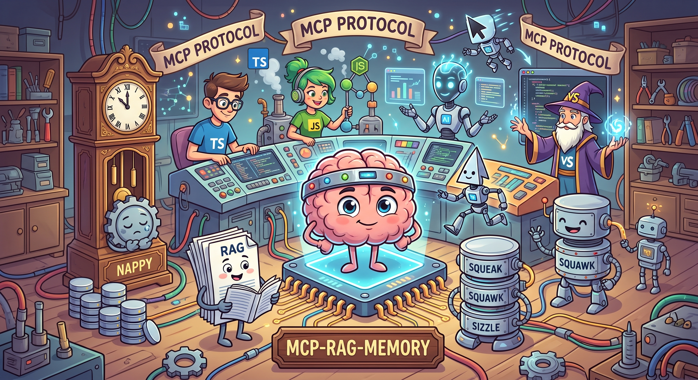

# RAG + Context Management MCP Server



Persistent long-term memory & knowledge retrieval for AI assistants.
Exposes RAG (vector storage + semantic search) and context management
(memories) as MCP tools, so opencode can store and recall
context **across sessions**.

> 👤 Identity: **The Coder** — "I'm The Coder, Selamat datang dan Semoga perjalanan mu menyenangkan"
>
> 📖 Project documentation site: https://adyoi.github.io/mcp-rag-memory/ (see [`docs/`](./docs/))

## What it does

- **RAG** — ingest documents (text / files / whole directories), chunk + embed locally, store in SQLite, and semantically retrieve relevant context.
- **Context Management** — `remember` facts/decisions/preferences, `recall` them later, rate by importance, consolidate duplicates, filter by type/tag.
- **Zero external APIs** — local hashing-embedder (1024-dim), built-in `node:sqlite`. Works fully offline.
- **MCP server** — runs on stdio, 18 tools.

## Quick start

```bash
npm install
npm test                 # 66 checks: unit + MCP round-trip via SDK client
npm run build            # compile to dist/
npm run cli -- stats     # CLI playground
```

## Works with any MCP client

This is a **standard MCP server** (stdio transport, official
`@modelcontextprotocol/sdk`). It speaks the MCP spec, so **any** agent
that supports MCP can use it — not just opencode. Memory & knowledge
become **shared across all your tools**: remember once, recall everywhere.

### opencode

```json
{
  "mcp": {
    "rag-memory": {
      "type": "local",
      "command": ["node", "--import", "tsx", "D:/Project/mcp-server/src/mcp/rag-server.ts"],
      "cwd": "D:/Project/mcp-server",
      "enabled": true,
      "environment": { "RAG_DB_DIR": "D:/Project/mcp-server/.rag-data" }
    }
  }
}
```

### Claude Desktop

`claude_desktop_config.json` (in `%APPDATA%\Claude`):

```json
{
  "mcpServers": {
    "rag-memory": {
      "command": "node",
      "args": ["--import", "tsx", "D:/Project/mcp-server/src/mcp/rag-server.ts"],
      "env": { "RAG_DB_DIR": "D:/Project/mcp-server/.rag-data" }
    }
  }
}
```

### Cursor / Windsurf

Settings → MCP → add server, same `command`/`args` pattern as Claude
Desktop. No `cwd` needed — use absolute paths for the entry file and DB.

### VS Code (Copilot)

`mcp.json` in `.vscode/`:

```json
{
  "servers": {
    "rag-memory": {
      "type": "stdio",
      "command": "node",
      "args": ["--import", "tsx", "D:/Project/mcp-server/src/mcp/rag-server.ts"],
      "env": { "RAG_DB_DIR": "D:/Project/mcp-server/.rag-data" }
    }
  }
}
```

> Tip: define a custom command to reuse anywhere, e.g.
> `mcp-rag-memory` pointing at
> `node --import tsx <abs-path>/src/mcp/rag-server.ts`.

## opencode configuration

### Global config (`~/.config/opencode/opencode.json`)

The MCP server is registered here so it works in **every project**, not just this folder:

```json
{
  "$schema": "https://opencode.ai/config.json",
  "mcp": {
    "rag-memory": {
      "type": "local",
      "command": ["node", "--import", "tsx", "src/mcp/rag-server.ts"],
      "cwd": "D:/Project/mcp-server",
      "enabled": true,
      "environment": {
        "RAG_DB_DIR": "D:/Project/mcp-server/.rag-data"
      }
    }
  }
}
```

> `cwd` and `RAG_DB_DIR` are absolute paths so the server resolves `tsx`
> from this project's `node_modules` and stores data in the same DB
> regardless of which project opencode is opened from.

### Project config (`opencode.json` in this repo)

Keeps project-specific settings (model, LSP, permissions, instructions) — **no `mcp` block here**:

```json
{
  "$schema": "https://opencode.ai/config.json",
  "model": "anthropic/claude-sonnet-4-6",
  "lsp": true,
  "instructions": [".opencode/instructions.md"],
  "permission": {
    "edit": "allow",
    "bash": { "git *": "allow", "*": "ask" }
  }
}
```

`.opencode/instructions.md` tells every new session to call
`memory_context(topic="The Coder")` first, so the assistant always knows
who you are without asking. The same instructions file is also wired into
the global config to apply to every project.

### Notifications & sound (`~/.config/opencode/tui.json`)

```json
{
  "$schema": "https://opencode.ai/tui.json",
  "attention": {
    "enabled": true,
    "sound": true,
    "notifications": true,
    "volume": 0.4
  }
}
```

Restart opencode after any config change.

## MCP tools (18)

| Group | Tool | Purpose |
|-------|------|---------|
| System | `system_stats` | DB dir, doc/memory counts |
| RAG ingest | `rag_ingest_text` | Store text as a knowledge document |
| | `rag_ingest_file` | Store a file (`content_type` auto-detected) |
| | `rag_ingest_dir` | Recursively ingest source files |
| RAG query | `rag_search` | Semantic search, ranked chunks + scores |
| | `rag_retrieve` | Ready-to-inject context block with token count |
| RAG docs | `rag_list_documents`, `rag_document_stats` | Inventory |
| | `rag_delete_document` | Remove a document + chunks |
| Memory | `memory_remember` | Save long-term memory (type/importance/tags) |
| | `memory_recall` | Semantic memory search (updates recall count) |
| | `memory_context` | Compact context block from memories for prompts |
| | `memory_list`, `memory_get`, `memory_update`, `memory_forget` | CRUD |
| | `memory_consolidate` | Dedupe near-identical + promote hot memories |
| | `memory_stats` | Counts, tokens, avg importance, by type |

## Custom slash commands

The 18 MCP tools are called by the AI automatically — but you can also
trigger them directly with custom commands. Sources (same name, project
wins):

- Per-project: `.opencode/commands/`
- Global: `~/.config/opencode/commands/`

| Command | Backing tool | Use |
|---------|--------------|-----|
| `/remember <content> [--type][--importance]` | `memory_remember` | Save a memory |
| `/recall <topic>` | `memory_recall` | Search memories semantically |
| `/context <topic>` | `memory_context` | Context block for prompts |
| `/consolidate` | `memory_consolidate` | Dedupe + promote hot memories |
| `/search <query>` | `rag_search` | Semantic search documents |
| `/retrieve <query>` | `rag_retrieve` | Raw context block + tokens |
| `/ingest <text>` | `rag_ingest_text` | Store knowledge text |
| `/docs` | `rag_list_documents` | List all documents |
| `/stats` | `system_stats` + doc/memory stats | Full statistics |

## CLI

```bash
npm run cli -- remember "deploys every Friday" --type task --importance 0.7
npm run cli -- recall "deployment schedule"
npm run cli -- ingest-dir ./src/rag
npm run cli -- search "vector similarity"
npm run cli -- mem-context "database"
```

## Architecture

```
src/
├── db/database.ts          node:sqlite (documents, chunks, memories)
├── rag/
│   ├── embedder.ts         local hashing embedder (1024-d, FNV-1a, n-grams)
│   ├── chunker.ts          paragraph/code-aware chunking with overlap
│   ├── vector-search.ts    cosine similarity brute-force
│   └── pipeline.ts         ingest / search / retrieve / document mgmt
├── memory/memory.ts        remember / recall / consolidate + stats
├── mcp/rag-server.ts       MCP server (18 tools, stdio)
├── cli.ts                  CLI playground
├── test/test-all.ts        full test suite (unit + MCP round-trip)
└── types/                  ambient type declarations
```

Data lives in `.rag-data/rag.sqlite` (git-ignored).

## Testing

`npm test` spins up the real MCP server over stdio using the SDK client
and exercises every tool end-to-end against a scratch DB (`.test-data`).

## GitHub Pages site

The [`docs/`](./docs/) directory is a self-contained static site of this
project (single `index.html`, no build step). To publish it on GitHub
Pages:

1. Push this repo to GitHub.
2. Repo **Settings → Pages → Build and deployment → Source: Deploy from a
   branch**.
3. Choose branch `main` and folder `/docs`.
4. Your site is live at `https://adyoi.github.io/mcp-rag-memory/`.

## Troubleshooting

### `ConfigInvalidError: missing key "command"` for typescript / javascript / json

The `lsp` block in `opencode.json` has the wrong shape.
Each language key must have a `command` array:

```json
"lsp": {
  "typescript": {
    "command": ["typescript-language-server", "--stdio"]
  }
}
```

Fields like `language_id` or `extensions` alone are not allowed — the
schema enforces `additionalProperties: false` and requires `command`.

**Fix:** either write the `command` array, or (if you just want built-in
LSP) replace the whole block with `"lsp": true`.

---

### MCP tools not showing up in opencode

1. **Wrong config filename** — opencode reads only `opencode.json`,
   `opencode.jsonc`, or `.opencode/opencode.json`. A file named
   `opencode.jsonx` is **silently ignored**; no error, no tools.
2. **File not in the right place** — global MCP config lives at
   `~/.config/opencode/opencode.json`, not in the project folder.
3. **Missing `cwd` for global use** — when `command` uses a relative
   path (`src/mcp/rag-server.ts`), opencode resolves it against the
   *workspace* directory, not the project. Add `"cwd"` to point at the
   project that contains `node_modules/tsx`:

```json
"rag-memory": {
  "type": "local",
  "command": ["node", "--import", "tsx", "src/mcp/rag-server.ts"],
  "cwd": "D:/Project/mcp-server"
}
```

4. **Missing env var** — `RAG_DB_DIR` must be set (absolute path for
   global config) or the DB defaults to `.rag-data` relative to cwd.

---

### Sound / notification not playing when response finishes

The `attention` feature is **off by default**. Create
`~/.config/opencode/tui.json`:

```json
{
  "$schema": "https://opencode.ai/tui.json",
  "attention": {
    "enabled": true,
    "sound": true,
    "notifications": true,
    "volume": 0.4
  }
}
```

**Known issue** ([#40445](https://github.com/anomalyco/opencode/issues/40445)):
sound silently fails when opencode runs under the **Node runtime** instead
of Bun — the audio library depends on Bun FFI. Symptoms: no sound despite
correct config. Not a configuration error.

---

### Server slow to start on first load (~3 s)

`tsx` compiles TypeScript on first invocation. This is normal and only
happens on cold start; subsequent tool calls within the same session are
instant.

---

### Opencode feels sluggish / UI lag after adding plugins

Plugins that run synchronous I/O or write to stderr on every tool call
can slow down the TUI. This project no longer ships any plugins — keep
`opencode.json` plugin-free for clean operation.

---

### `ajv-cli` fails with `strict mode: unknown keyword: allowComments`

The opencode schema uses custom JSON-Schema extensions (`allowComments`,
`allowTrailingCommas`). `ajv-cli` rejects these by default. Validate
config manually instead:

```bash
node -e "JSON.parse(require('fs').readFileSync('opencode.json','utf8')); console.log('OK')"
```
