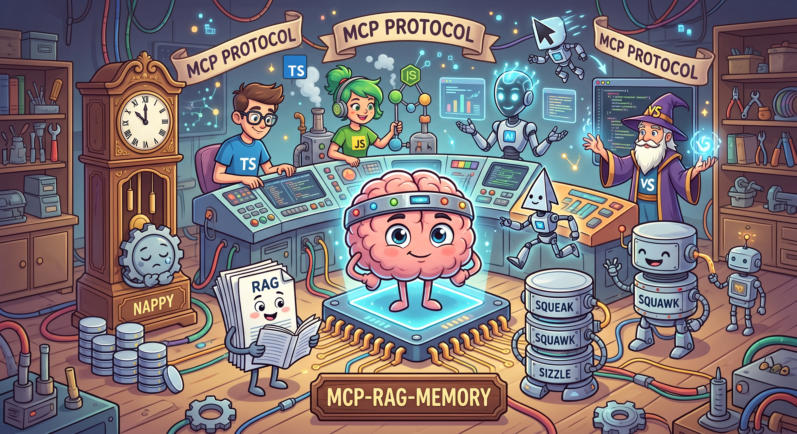

# RAG + Context Management MCP Server



Persistent long-term memory & knowledge retrieval for AI assistants.
Exposes RAG (vector storage + semantic search) and context management
(memories) as MCP tools, so opencode can store and recall
context **across sessions**.

> 👤 Identity: **The Coder** — "I'm The Coder, Selamat datang dan Semoga perjalanan mu menyenangkan"
>
> 📖 Project documentation site: https://adyoi.github.io/mcp-rag-memory/ (see [`docs/`](./docs/))

## What it does

- **RAG** — ingest documents (text / files / whole directories), chunk + embed locally, store in SQLite, and semantically retrieve relevant context.
- **Hybrid search** — FTS5 BM25 keyword hits fused with vector similarity (reciprocal-rank fusion). Tunable `SEARCH_MODE=hybrid|vector|keyword`.
- **Context Management** — `remember` facts/decisions/preferences, `recall` them later (score-decayed by staleness), rate by importance, consolidate duplicates, filter by type/tag.
- **Zero external APIs by default** — local hashing-embedder (1024-dim), built-in `node:sqlite`. Works fully offline. Optional `EMBEDDING_PROVIDER=transformers` for a higher-quality ONNX model.
- **Safe ingestion** — content-hash deduplication, file size guard (`RAG_MAX_FILE_MB`) and an opt-in path allowlist (`RAG_ALLOWED_DIRS`).
- **MCP server** — runs on stdio, 20 tools.

## Quick start

Requires **Node.js ≥ 22.12** (for `node:sqlite` read-only handles and
`busy_timeout`).

```bash
npm install
npm test                 # 160 checks: unit + MCP round-trip via SDK client
npm run lint             # oxlint
npm run typecheck        # src + scripts + .opencode/plugin
npm run build            # compile to dist/
npm run cli -- docs      # CLI playground
```

### Run from npm (npx)

Install or run directly from the npm package — no `tsx`, no source checkout:

```bash
npx mcp-rag-memory
```

Point your MCP client at `npx mcp-rag-memory` (the published `bin`), or
at the local dev entry: `node --import tsx src/mcp/rag-server.ts`.

## Works with any MCP client

This is a **standard MCP server** (stdio transport, official
`@modelcontextprotocol/sdk`). It speaks the MCP spec, so **any** agent
that supports MCP can use it — not just opencode. Memory & knowledge
become **shared across all your tools**: remember once, recall everywhere.

### opencode

```json
{
  "mcp": {
    "rag-memory": {
      "type": "local",
      "command": ["node", "--import", "tsx", "D:/Project/mcp-server/src/mcp/rag-server.ts"],
      "cwd": "D:/Project/mcp-server",
      "enabled": true,
      "environment": { "RAG_DB_DIR": "D:/Project/mcp-server/.rag-data" }
    }
  }
}
```

### Claude Desktop

`claude_desktop_config.json` (in `%APPDATA%\Claude`):

```json
{
  "mcpServers": {
    "rag-memory": {
      "command": "node",
      "args": ["--import", "tsx", "D:/Project/mcp-server/src/mcp/rag-server.ts"],
      "env": { "RAG_DB_DIR": "D:/Project/mcp-server/.rag-data" }
    }
  }
}
```

### Cursor / Windsurf

Settings → MCP → add server, same `command`/`args` pattern as Claude
Desktop. No `cwd` needed — use absolute paths for the entry file and DB.

### VS Code (Copilot)

`mcp.json` in `.vscode/`:

```json
{
  "servers": {
    "rag-memory": {
      "type": "stdio",
      "command": "node",
      "args": ["--import", "tsx", "D:/Project/mcp-server/src/mcp/rag-server.ts"],
      "env": { "RAG_DB_DIR": "D:/Project/mcp-server/.rag-data" }
    }
  }
}
```

> Tip: once published (or installed), just point every client at
> `npx mcp-rag-memory` — no `tsx`, no absolute paths, no local checkout.
> Locally you can still use `node --import tsx <abs-path>/src/mcp/rag-server.ts`.

## opencode configuration

### Global config (`~/.config/opencode/opencode.json`)

The MCP server is registered here so it works in **every project**, not just this folder:

```json
{
  "$schema": "https://opencode.ai/config.json",
  "mcp": {
    "rag-memory": {
      "type": "local",
      "command": ["node", "--import", "tsx", "src/mcp/rag-server.ts"],
      "cwd": "D:/Project/mcp-server",
      "enabled": true,
      "environment": {
        "RAG_DB_DIR": "D:/Project/mcp-server/.rag-data"
      }
    }
  }
}
```

> `cwd` and `RAG_DB_DIR` are absolute paths so the server resolves `tsx`
> from this project's `node_modules` and stores data in the same DB
> regardless of which project opencode is opened from.

**Re-assert this global config with one command.** opencode updates have
been observed to reset/wipe the global config (the MCP server, plugin,
LSP and instructions disappear from new sessions). `scripts/setup-opencode.*`
rewrite both `opencode.json` and `opencode.jsonc` (PowerShell on Windows,
portable bash elsewhere; dispatcher `npm run setup-opencode`), **merging**
with what is already there — user keys are never clobbered, arrays
(`instructions`, `plugin`) are unioned, broken files are backed up to
`.bak-<ts>`, and runs are idempotent. Re-run it (and restart opencode)
after any opencode update:

```bash
npm run setup-opencode          # merge-in our defaults
npm run setup-opencode -- --check   # exit 0 = up to date, 1 = changes pending
```

### Project config (`opencode.json` in this repo)

Keeps project-specific settings (model, LSP, permissions, instructions) — **no `mcp` block here**:

```json
{
  "$schema": "https://opencode.ai/config.json",
  "model": "anthropic/claude-sonnet-4-6",
  "lsp": true,
  "instructions": [".opencode/instructions.md"],
  "permission": {
    "edit": "allow",
    "bash": { "git *": "allow", "*": "ask" }
  }
}
```

`.opencode/instructions.md` tells every new session to call
`memory_context(topic="The Coder")` first, so the assistant always knows
who you are without asking. The same instructions file is also wired into
the global config to apply to every project.

### Notifications & sound (`~/.config/opencode/tui.json`)

```json
{
  "$schema": "https://opencode.ai/tui.json",
  "attention": {
    "enabled": true,
    "sound": true,
    "notifications": true,
    "volume": 0.4
  }
}
```

Restart opencode after any config change.

## MCP tools (20)

| Group | Tool | Purpose |
|-------|------|---------|
| System | `system_stats` | DB dir, embedding backend (incl. what the vector leg measures), store state, doc/memory counts |
| Maintenance | `rag_reindex` | Re-embed every stored vector for the current model, migrating the store in place |
| RAG ingest | `rag_ingest_text` | Store text as a knowledge document (dedup-aware) |
| | `rag_ingest_file` | Store a file (`content_type` auto-detected) |
| | `rag_ingest_dir` | Recursively ingest source files |
| RAG query | `rag_search` | Hybrid (BM25 + vector) search, ranked chunks + scores; `explain: true` adds per-leg scores |
| | `rag_retrieve` | Ready-to-inject context block with token count |
| RAG docs | `rag_list_documents`, `rag_document_stats` | Inventory (`rag_list_documents` is paginated: `limit` 1–1000, `offset`) |
| | `rag_delete_document` | Remove a document + chunks + FTS rows |
| Session sync | `rag_sync_session` | Ingest an opencode session's user inputs (or the latest in a workspace) |
| Memory | `memory_remember` | Save long-term memory (type/importance/tags) |
| | `memory_recall` | Semantic memory search (decay + recall count) |
| | `memory_context` | Compact context block from memories for prompts |
| | `memory_list`, `memory_get`, `memory_update`, `memory_forget` | CRUD |
| | `memory_consolidate` | Dedupe near-identical (cosine **and** word overlap) + promote hot memories |
| | `memory_stats` | Counts, tokens, avg importance, by type |

## Run in other AI assistants

The server is a standard MCP stdio server — it works with any MCP client
(Claude Desktop, Cursor, Continue, VS Code, ...), not just opencode.

**Via `npx` (after publishing).**

```bash
npx mcp-rag-memory
```

**Claude Desktop** — `claude_desktop_config.json`:

```json
{
  "mcpServers": {
    "rag-memory": {
      "command": "npx",
      "args": ["-y", "mcp-rag-memory"],
      "env": { "RAG_DB_DIR": "C:\\Users\\you\\rag-data" }
    }
  }
}
```

**Cursor** (`.cursor/mcp.json`) — `continue` style JSON, same shape:

```json
{
  "mcpServers": {
    "rag-memory": {
      "command": "node",
      "args": ["D:/Project/mcp-server/dist/index.js"],
      "env": { "RAG_DB_DIR": "D:/Project/mcp-server/.rag-data" }
    }
  }
}
```

**Continue** — `~/.continue/config.json`:

```json
{
  "mcpServers": {
    "rag-memory": {
      "type": "stdio",
      "command": "node",
      "args": ["D:/Project/mcp-server/dist/index.js"]
    }
  }
}
```

**Configuration.** Every `RAG_*` variable can come from three places, with the
first winning: the MCP client's `env` block → your shell environment → a
`.env` file in the working directory. Copy [`.env.example`](./.env.example) to
`.env` and edit, or point at any file via `RAG_ENV_FILE`. The store defaults to
`.rag-data/` in the working directory.

## Changing the embedding model

The store refuses to mix vector spaces: if `EMBEDDING_MODEL` changes, searching
with new vectors against old ones would silently blend two spaces and return
noise. `ensureDim` catches the mismatch and tells you to point `RAG_DB_DIR` at a
fresh directory and re-ingest — correct, but for a memory store holding months of
history that is a manual rebuild rather than a migration.

`reindex` does the migration in place. It re-embeds every chunk and memory for the
currently configured provider/model, then rewrites the store metadata.

```bash
# 1. install the optional provider
npm i @huggingface/transformers

# 2. migrate the existing store (documents' text is the source of truth)
EMBEDDING_PROVIDER=transformers \
EMBEDDING_MODEL=Xenova/all-MiniLM-L6-v2 \
npm run cli -- reindex --batch 32

# 3. bake the provider into .env so the server uses it from now on
```

Or over MCP: the `rag_reindex` tool takes the same `batch_size`.

**How interruption behaves.** A half-migrated store mixes old and new vectors, so
`reindex` marks the store `reindexing` for its whole duration and every search,
recall and ingest refuses to run while that flag is set. This is deliberate: the
failure mode of a partial migration is confident nonsense, and nothing about the
results would reveal it. If the process dies mid-run, just run `reindex` again —
the whole store is rewritten from text, so resuming is identical to starting over.
`system_stats` reports `storeState` and the remediation if you hit this.

Re-running is always safe: embedding is deterministic per model, so `reindex` is
idempotent. On an empty store it is a no-op that just records the model.

## Custom slash commands

The 20 MCP tools are called by the AI automatically — but you can also
trigger them directly with custom commands. Sources (same name, project
wins):

- Per-project: `.opencode/commands/`
- Global: `~/.config/opencode/commands/`

| Command | Backing tool | Use |
|---------|--------------|-----|
| `/remember <content> [--type][--importance]` | `memory_remember` | Save a memory |
| `/recall <topic>` | `memory_recall` | Search memories semantically |
| `/context <topic>` | `memory_context` | Context block for prompts |
| `/consolidate` | `memory_consolidate` | Dedupe + promote hot memories |
| `/search <query>` | `rag_search` | Semantic search documents |
| `/retrieve <query>` | `rag_retrieve` | Raw context block + tokens |
| `/ingest <text>` | `rag_ingest_text` | Store knowledge text |
| `/docs` | `rag_list_documents` | List all documents |
| `/stats` | `system_stats` + doc/memory stats | Full statistics |

## CLI

```bash
npm run cli -- remember "deploys every Friday" --type task --importance 0.7
npm run cli -- recall "deployment schedule"
npm run cli -- ingest-dir ./src/rag
npm run cli -- search "vector similarity"
npm run cli -- search "auth bug" --source opencode-db   # filter by source or doc-id
npm run cli -- search "auth bug" --explain              # per-leg vector/keyword/RRF scores
npm run cli -- docs --limit 20 --offset 20            # paginated inventory
npm run cli -- mem-context "database"
npm run cli -- sessions              # list recent opencode sessions
npm run cli -- sync-session ses_123  # ingest one session's inputs
npm run cli -- sync-latest           # ingest the most recent session
npm run cli -- reindex --batch 32    # re-embed all vectors for the current model
npm run clean-db -- --force          # wipe ALL documents + memories (destructive)
```

`mcp-rag-memory` is also a global CLI. Install once (`npm i -g mcp-rag-memory`)
and run `mcp-rag-memory-cli search "..."` anywhere; the CLI reads `<cwd>/.env`
or `RAG_ENV_FILE` to locate its store, so one store per project is enough.

Semua akses juga tersedia sebagai custom commands (`/remember`, `/recall`,
`/search`, ...) dan sebagai MCP tools.

## Auto-save session inputs

Every user **message** typed in opencode can be mirrored into the RAG store as
small searchable documents (metadata `source: "opencode-db"`), kept separate
from your curated long-term memories. Three layers:

1. **Plugin (real-time, debounced, cross-workspace).**
   `.opencode/plugin/session-logger.ts` watches message events and, at most
   once a minute, runs the portable CLI — `npx -y -p mcp-rag-memory
   mcp-rag-memory-cli sync-latest --dir <workspace>` — so the session you are
   typing in lands in the store. Because it invokes the published package (not
   this repo's scripts), it works in **any** project that adds the plugin and a
   `.env` pointing at its store. Disable with `RAG_AUTOSYNC=0`.
2. **CLI on demand.**
   ```bash
   npx -y -p mcp-rag-memory mcp-rag-memory-cli sync-latest --dir "D:/Project/my-app"  # latest session in a workspace
   npx -y -p mcp-rag-memory mcp-rag-memory-cli sync-session ses_abc123                # a specific session
   npx -y -p mcp-rag-memory mcp-rag-memory-cli sync-logs                              # .session-logs/*.jsonl
   ```
3. **MCP tool.** `rag_sync_session` exposes the same logic over MCP:
   `{ "session_id": "..." }` or `{ "directory": "..." }` for the latest.

> Honest scope note: the **plugin** only ships with this repo out of the box,
> but it is a plain node script — copy it into any workspace (and give that
> project an `.env`) and auto-save just works, since it shells out to the
> published CLI bin (`mcp-rag-memory-cli`, inside the `mcp-rag-memory` package)
> via npx. Without a plugin, auto-save is
> "manual": run layer 2 or call layer 3 whenever you want a session ingested.

How it works: sessions are read from opencode's own DB
(`~/.local/share/opencode/opencode.db` + `opencode-local.db`, override with
`OPENCODE_DB` / `OPENCODE_DB_LOCAL`), each user message becomes one small
document (title `<session>-<ts>`, metadata `source: "opencode-db"`). Long
inputs are **condensed to key points** before storage (extractive, no LLM) so
the store stays lean; short inputs are saved whole. Raw transcripts stay in
opencode's DB; long-term **memories** are never mixed in. Re-runs are
idempotent thanks to SHA-256 content-hash dedup (`metadata.condensed` marks
reduced docs), so plugging this into any scheduler is safe. A schema guard
raises a clear error (instead of mysterious SQL failures) if your opencode DB
layout changes to an unsupported shape.

The plugin needs an opencode restart to take effect.

## Performance & limits

- **Search is brute-force cosine / FTS5 over every chunk**: `O(N)` per query
    (exact, deterministic — good for a personal store of thousands of chunks).
    ANN / HNSW indexing is planned scope (v3) for 100k+ chunks.
- **The vector cache holds every vector in RAM**, uncapped and complete. Truncating
    it would silently change which documents are findable, so the cache stays whole
    and the server warns instead: 8 KB per row at the default 1024 dims, so 100k
    chunks is roughly 800 MB. Tune the warning threshold with
    `RAG_VECTOR_CACHE_WARN_MB` (default 256). Beyond a few hundred thousand chunks,
    expect to prune rather than scale.
- Keyword leg uses the FTS5 **trigram** tokenizer, so CJK text and
  Indonesian-style substring/inflection matching work without extra config.
  Consequence: keyword terms of **≤ 2 characters are skipped** (trigram needs
  3); the vector leg still covers them.
- Vector embeddings are local hash-based (no external APIs, ~0 cost, offline).
    They are tuned for short-phrase similarity, not full-document semantics.

### What the vector leg actually measures

This matters more than it sounds, so the server states it explicitly in
`system_stats` (`embedding.vectorLeg`) rather than calling everything "semantic".

| Provider | `vectorLeg` | Meaning |
|---|---|---|
| `local` (default) | `lexical` | Hashes character 1/2/3-grams into 1024 buckets. Scores **lexical and sub-word overlap**, not meaning. |
| `transformers` | `semantic` | Real sentence embeddings from `EMBEDDING_MODEL`. Captures meaning. |

Consequence for the default: `"cara fix login"` and `"masalah autentikasi"`
share almost no n-grams, so the **vector** leg scores near zero even though they
mean the same thing. Retrieval still works because the **FTS5 trigram** leg
carries the query, and because the local embedder does respond to shared substrings
and character shapes. What you should not expect from the default is
paraphrase-level recall — restating a concept with different vocabulary is the
known blind spot.

To get true semantic recall, install the optional dependency and migrate in place:

```bash
npm i @huggingface/transformers
EMBEDDING_PROVIDER=transformers EMBEDDING_MODEL=Xenova/all-MiniLM-L6-v2 npm run cli -- reindex
```

`reindex` rewrites every stored vector for the new model. See
[Changing the embedding model](#changing-the-embedding-model).

### Debugging a bad search

`rag_search` accepts `explain: true` (CLI: `--explain`), which attaches the
per-leg diagnostics to every hit:

```jsonc
{
  "score": 0.71,          // final relevance, 0..1 — what min_score filters on
  "legs": ["vector", "keyword"],
  "explain": {
    "vectorScore": 0.63,  // cosine similarity, -1..1
    "keywordScore": 1.0,  // BM25 normalised against the best hit, 0..1
    "rrfScore": 0.0246,   // fused contribution that decided the order
    "vectorRank": 0,
    "keywordRank": 2
  }
}
```

| Symptom | Likely cause |
|---|---|
| `legs: ["keyword"]`, no `vectorScore` | Only the trigram leg matched. Expected for paraphrase queries under the `local` provider. |
| `legs: ["vector"]` with a low `vectorScore` | Lexical overlap only. Rephrase, or switch provider. |
| `keywordScore` near 0 for every hit | The query terms are absent from the corpus, or under 3 characters. |
| No hits at all | Lower `min_score`, or set `SEARCH_MODE=keyword` to isolate which leg is failing. |

## Architecture

```
src/
├── db/database.ts          node:sqlite (documents, chunks, memories, chunks_fts, meta)
├── rag/
│   ├── embedder.ts         local hashing embedder (1024-d, FNV-1a, n-grams)
│   ├── embeddings.ts       provider layer: local | transformers (optional dep)
│   ├── chunker.ts          paragraph/code-aware chunking with overlap
│   ├── vector-search.ts    vector cache + FTS5 BM25 + RRF hybrid scoring
│   └── pipeline.ts         async ingest/search/retrieve, dedup, guards, doc mgmt
├── session/transcript.ts   read opencode sessions (global+local DB), ingest inputs
├── memory/memory.ts        remember / recall / consolidate + decay + prune
├── mcp/rag-server.ts       MCP server (20 tools, stdio, npm bin)
├── cli.ts                  CLI playground (incl. sync-session / sync-latest / sync-logs)
└── test/test-all.ts        full test suite (unit + MCP round-trip)
```

Data lives in `.rag-data/rag.sqlite` (git-ignored).

## Configuration (env vars)

| Variable | Default | Purpose |
|----------|---------|---------|
| `RAG_DB_DIR` | `.rag-data` | Where the SQLite store lives |
| `SEARCH_MODE` | `hybrid` | `hybrid` \| `vector` \| `keyword` |
| `EMBEDDING_PROVIDER` | `local` | `local` (zero-dep) \| `transformers` (needs optional `@huggingface/transformers`) |
| `EMBEDDING_MODEL` | `Xenova/all-MiniLM-L6-v2` | Transformers model name |
| `RAG_MAX_FILE_MB` | `10` | Reject files larger than this |
| `RAG_ALLOWED_DIRS` | *(unset = anywhere)* | Semicolon/pipe/comma-separated allowed ingest roots |
| `RAG_MEMORY_HALF_LIFE_DAYS` | `14` | Recall score decay half-life |
| `RAG_DEDUP_MAX_VECTORS` | `500` | Above this many memories `consolidate` skips near-duplicate detection and reports `skippedDedup`. Raise it on a dedicated server (the pass is O(n²)) |
| `RAG_VECTOR_CACHE_WARN_MB` | `256` | Warn when the in-memory vector cache exceeds this size |
| `RAG_PRUNE` | `0` | Set `1` to allow `consolidate` to delete non-essential memories |
| `RAG_PRUNE_IMPORTANCE` | `0.2` | Delete memories below this importance |
| `RAG_PRUNE_AGE_DAYS` | `90` | ...and older than this (never-recalled only) |
| `RAG_AUTOSYNC` | `1` | Set `0` to disable the session-logger plugin's auto-sync |
| `OPENCODE_DB` / `OPENCODE_DB_LOCAL` | `~/.local/share/opencode/*.db` | Where session transcripts are read from (re-read on every call, so it can be set late) |
| `RAG_SESSION_MAX_MSGS` | `500` | Cap on user messages read from one session |
| `RAG_SESSION_CONDENSE` | `1` | Set `0` to store session inputs verbatim |
| `RAG_SESSION_CONDENSE_MIN_CHARS` | `120` | Inputs at/below this length are saved whole |
| `RAG_SESSION_CONDENSE_RATIO` | `0.35` | Fraction of long-input length to keep as key points |
| `RAG_ENV_FILE` | `<cwd>/.env` | Env file to load at boot |

A `.env` file can only set this server's own variables (`RAG_*`,
`OPENCODE_*`, `EMBEDDING_*`, `SEARCH_MODE`); anything else in it is
ignored with a warning on stderr, and a real environment variable always
wins over the file. The loader runs from `dist/index.js` and
`dist/cli.js` only — if you invoke `src/mcp/rag-server.ts` directly
(TSX/`npx tsx`), import `src/env.js` yourself.

## Testing

`npm test` spins up the real MCP server over stdio using the SDK client
and exercises every tool end-to-end against a scratch DB (`.test-data`).
`npm run lint` checks the codebase with oxlint (run in CI too).

## GitHub Pages site

The [`docs/`](./docs/) directory is a self-contained static site of this
project (single `index.html`, no build step). To publish it on GitHub
Pages:

1. Push this repo to GitHub.
2. Repo **Settings → Pages → Build and deployment → Source: Deploy from a
   branch**.
3. Choose branch `main` and folder `/docs`.
4. Your site is live at `https://adyoi.github.io/mcp-rag-memory/`.

## Troubleshooting

### `ConfigInvalidError: missing key "command"` for typescript / javascript / json

The `lsp` block in `opencode.json` has the wrong shape.
Each language key must have a `command` array:

```json
"lsp": {
  "typescript": {
    "command": ["typescript-language-server", "--stdio"]
  }
}
```

Fields like `language_id` or `extensions` alone are not allowed — the
schema enforces `additionalProperties: false` and requires `command`.

**Fix:** either write the `command` array, or (if you just want built-in
LSP) replace the whole block with `"lsp": true`.

---

### MCP tools not showing up in opencode

1. **Wrong config filename** — opencode reads only `opencode.json`,
   `opencode.jsonc`, or `.opencode/opencode.json`. A file named
   `opencode.jsonx` is **silently ignored**; no error, no tools.
2. **File not in the right place** — global MCP config lives at
   `~/.config/opencode/opencode.json`, not in the project folder.
3. **Missing `cwd` for global use** — when `command` uses a relative
   path (`src/mcp/rag-server.ts`), opencode resolves it against the
   *workspace* directory, not the project. Add `"cwd"` to point at the
   project that contains `node_modules/tsx`:

```json
"rag-memory": {
  "type": "local",
  "command": ["node", "--import", "tsx", "src/mcp/rag-server.ts"],
  "cwd": "D:/Project/mcp-server"
}
```

4. **Missing env var** — `RAG_DB_DIR` must be set (absolute path for
   global config) or the DB defaults to `.rag-data` relative to cwd.

---

### Sound / notification not playing when response finishes

The `attention` feature is **off by default**. Create
`~/.config/opencode/tui.json`:

```json
{
  "$schema": "https://opencode.ai/tui.json",
  "attention": {
    "enabled": true,
    "sound": true,
    "notifications": true,
    "volume": 0.4
  }
}
```

**Known issue** ([#40445](https://github.com/anomalyco/opencode/issues/40445)):
sound silently fails when opencode runs under the **Node runtime** instead
of Bun — the audio library depends on Bun FFI. Symptoms: no sound despite
correct config. Not a configuration error.

---

### Server slow to start on first load (~3 s)

`tsx` compiles TypeScript on first invocation. This is normal and only
happens on cold start; subsequent tool calls within the same session are
instant.

---

### Opencode feels sluggish / UI lag after adding plugins

Plugins that run synchronous I/O or write to stderr on every tool call
can slow down the TUI. This repo ships exactly one plugin
(`.opencode/plugin/session-logger.ts`) and it is debounced to at most one
`npx … sync-latest` per 60s, spawned detached with `stdio: "ignore"` and
`shell: false`. If it still costs too much, set `RAG_AUTOSYNC=0` (keeps the
plugin, disables the auto-sync) or drop the `plugin` entry from
`opencode.json` — the MCP server and its 20 tools keep working, you just have
to call `rag_sync_session` yourself.

---

### `ajv-cli` fails with `strict mode: unknown keyword: allowComments`

The opencode schema uses custom JSON-Schema extensions (`allowComments`,
`allowTrailingCommas`). `ajv-cli` rejects these by default. Validate
config manually instead:

```bash
node -e "JSON.parse(require('fs').readFileSync('opencode.json','utf8')); console.log('OK')"
```
